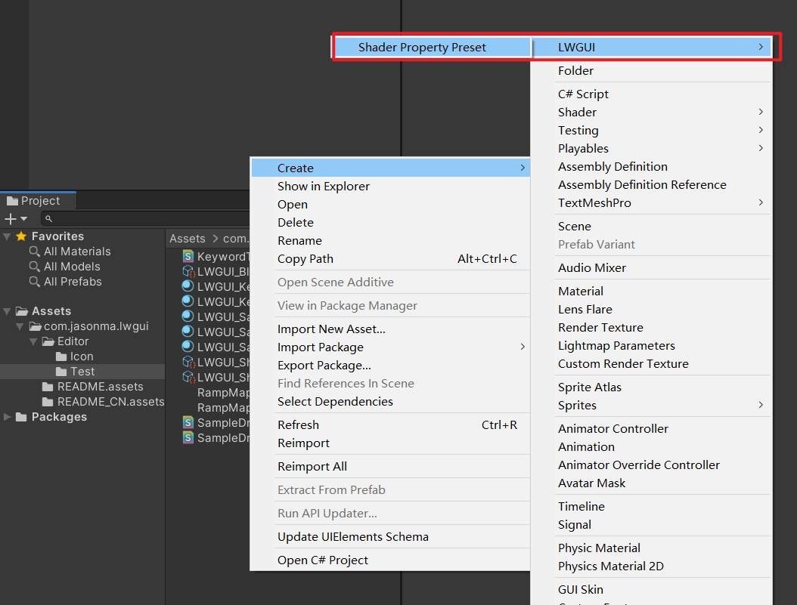
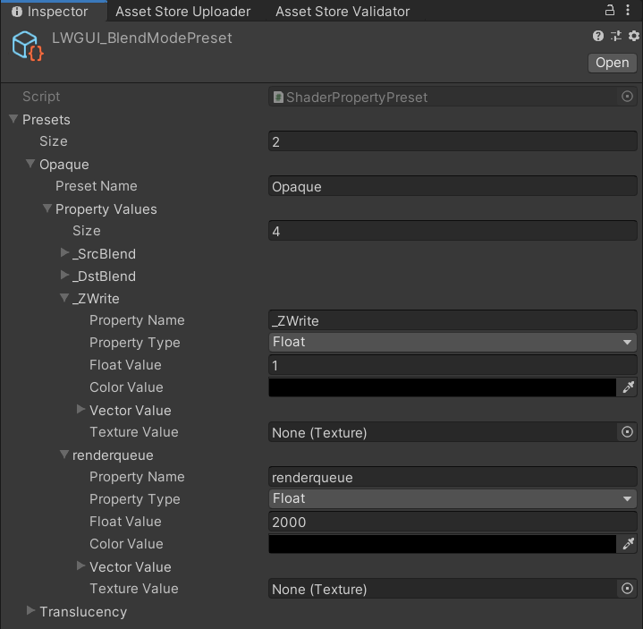
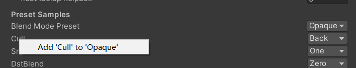
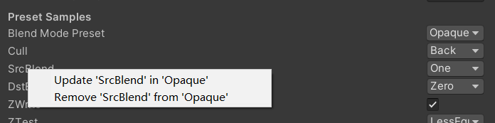

# LWGUI (Light Weight Shader GUI)

[中文](https://github.com/JasonMa0012/LWGUI/blob/main/README_CN.md) | [English](https://github.com/JasonMa0012/LWGUI)

A Lightweight, Flexible, Powerful **Unity Shader GUI** system.

Use simple MaterialProperty Drawer syntax to achieve complex Shader GUI, save a lot of development time, easy to use and expand, effectively improve the user experience of artists.


- [LWGUI (Light Weight Shader GUI)](#lwgui--light-weight-shader-gui-)
  * [Installation](#installation)
  * [Usage](#usage)
    + [Getting Started](#getting-started)
    + [LWGUI Drawers](#lwgui-drawers)
      - [Main - Sub](#main---sub)
      - [SubToggle](#subtoggle)
      - [SubPower](#subpower)
      - [KWEnum](#kwenum)
      - [SubEnum - SubKeywordEnum](#subenum---subkeywordenum)
      - [Tex - Color](#tex---color)
      - [Channel](#channel)
      - [Ramp](#ramp)
      - [MinMaxSlider](#minmaxslider)
    + [LWGUI Decorator](#lwgui-decorator)
      - [Title](#title)
      - [Tooltip - Helpbox](#tooltip---helpbox)
    + [Unity Builtin Drawers](#unity-builtin-drawers)
      - [Space](#space)
      - [Header](#header)
      - [Enum](#enum)
      - [IntRange](#intrange)
      - [KeywordEnum](#keywordenum)
      - [PowerSlider](#powerslider)
      - [Toggle](#toggle)
    + [Tips](#tips)
  * [TODO](#todo)
  * [Contribution](#contribution)
    + [Tips](#tips-1)


## Installation

1. Make sure your environment is compatible with LWGUI: **Unity 2017.4+**
2. Open your project
3. `Window > Package Manager > Add > Add package from git URL` , enter: `https://github.com/JasonMa0012/LWGUI.git`

   - You can also choose to manually download the Zip from Github，then: `Package Manager > Add package from disk`
   - For Unity 2017, please extract the Zip directly to the Assets directory

## Usage

### Getting Started

1. Create a newer or use the existing Shader
2. Open the Shader in the code editor
3. At the bottom of the Shader, before the last large bracket, add line:`CustomEditor "LWGUI.LWGUI"`
4. Completed! Start using the following powerful Drawer to easily draw your Shader GUI
   - MaterialPropertyDrawer is C#-like attribute syntax, it can be used in front of shader properties to change the drawing method, more information can be found in the official documentation: https://docs.unity3d.com/ScriptReference/MaterialPropertyDrawer.html

### LWGUI Drawers

#### Main - Sub

```c#
/// Create a Folding Group
/// group：group name (Default: Property Name)
/// keyword：keyword used for toggle, "_" = ignore, none or "__" = Property Name +  "_ON", always Upper (Default: none)
/// default Folding State: "on" or "off" (Default: off)
/// default Toggle Displayed: "on" or "off" (Default: on)
/// Target Property Type: FLoat, express Toggle value
MainDrawer(string group, string keyword, string defaultFoldingState, string defaultToggleDisplayed)
```

```c#
/// Draw a property with default style in the folding group
/// group：father group name, support suffix keyword for conditional display (Default: none)
/// Target Property Type: Any
SubDrawer(string group)
```

Example:

```c#
[Title(Main Samples)]
[Main(GroupName)]
_group ("Group", float) = 0
[Sub(GroupName)] _float ("Float", float) = 0


[Main(Group1, _KEYWORD, on)] _group1 ("Group - Default Open", float) = 1
[Sub(Group1)] _float1 ("Sub Float", float) = 0
[Sub(Group1)] _vector1 ("Sub Vector", vector) = (1, 1, 1, 1)
[Sub(Group1)] [HDR] _color1 ("Sub HDR Color", color) = (0.7, 0.7, 1, 1)

[Title(Group1, Conditional Display Samples       Enum)]
[KWEnum(Group1, Name 1, _KEY1, Name 2, _KEY2, Name 3, _KEY3)]
_enum ("KWEnum", float) = 0

// Display when the keyword ("group name + keyword") is activated
[Sub(Group1_KEY1)] _key1_Float1 ("Key1 Float", float) = 0
[Sub(Group1_KEY2)] _key2_Float2 ("Key2 Float", float) = 0
[Sub(Group1_KEY3)] _key3_Float3_Range ("Key3 Float Range", Range(0, 1)) = 0
[SubPowerSlider(Group1_KEY3, 10)] _key3_Float4_PowerSlider ("Key3 Power Slider", Range(0, 1)) = 0

[Title(Group1, Conditional Display Samples       Toggle)]
[SubToggle(Group1, _TOGGLE_KEYWORD)] _toggle ("SubToggle", float) = 0
[Tex(Group1_TOGGLE_KEYWORD)][Normal] _normal ("Normal Keyword", 2D) = "bump" { }
[Sub(Group1_TOGGLE_KEYWORD)] _float2 ("Float Keyword", float) = 0


[Main(Group2, _, off, off)] _group2 ("Group - Without Toggle", float) = 0
[Sub(Group2)] _float3 ("Float 2", float) = 0

```

Default result:


Then change values:


#### SubToggle

```c#
/// Similar to builtin Toggle()
/// group：father group name, support suffix keyword for conditional display (Default: none)
/// keyword：keyword used for toggle, "_" = ignore, none or "__" = Property Name +  "_ON", always Upper (Default: none)
/// Target Property Type: FLoat
SubToggleDrawer(string group, string keyWord)
```


#### SubPower

```c#
/// Similar to builtin PowerSlider()
/// group：father group name, support suffix keyword for conditional display (Default: none)
/// power: power of slider (Default: 1)
/// Target Property Type: Range
SubPowerSliderDrawer(string group, float power)
```


#### SubIntRange

```c#
/// Similar to builtin IntRange()
/// group：father group name, support suffix keyword for conditional display (Default: none)
/// Target Property Type: Range
SubIntRangeDrawer(string group)
```


#### KWEnum

```c#
/// <summary>
/// Similar to builtin Enum() / KeywordEnum()
/// group：father group name, support suffix keyword for conditional display (Default: none)
/// n(s): display name
/// k(s): keyword
/// v(s): value
/// Target Property Type: FLoat, express current keyword index
/// </summary>
KWEnumDrawer(string group, string n1, string k1, string n2, string k2, string n3, string k3, string n4, string k4, string n5, string k5)
```


#### SubEnum - SubKeywordEnum

```c#
// enumName: like "UnityEngine.Rendering.BlendMode"
SubEnumDrawer(string group, string enumName)
    
SubEnumDrawer(string group, string n1, float v1, string n2, float v2, string n3, float v3, string n4, float v4, string n5, float v5, string n6, float v6, string n7, float v7)

SubKeywordEnumDrawer(string group, string kw1, string kw2, string kw3, string kw4, string kw5, string kw6, string kw7, string kw8, string kw9)
```


#### Tex - Color

```c#
/// Draw a Texture property in single line with a extra property
/// group：father group name, support suffix keyword for conditional display (Default: none)
/// extraPropName: extra property name (Unity 2019.2+ only) (Default: none)
/// Target Property Type: Texture
/// Extra Property Type: Any, except Texture
TexDrawer(string group, string extraPropName)
```

```c#
/// Display up to 4 colors in a single line
/// group：father group name, support suffix keyword for conditional display (Default: none)
/// color2-4: extra color property name (Unity 2019.2+ only)
/// Target Property Type: Color
ColorDrawer(string group, string color2, string color3, string color4)
```

Example:

```c#
[Main(Group3, _, on)] _group3 ("Group - Tex and Color Samples", float) = 0
[Tex(Group3, _color)] _tex_color ("Tex with Color", 2D) = "white" { }
[HideInInspector] _color (" ", Color) = (1, 0, 0, 1)
[Tex(Group3, _float4)] _tex_float ("Tex with Float", 2D) = "white" { }
[HideInInspector] _float4 (" ", float) = 0
[Tex(Group3, _range)] _tex_range ("Tex with Range", 2D) = "white" { }
[HideInInspector] _range (" ", Range(0,1)) = 0
[Tex(Group3, _textureChannelMask1)] _tex_channel ("Tex with Channel", 2D) = "white" { }
[HideInInspector] _textureChannelMask1(" ", Vector) = (0,0,0,1)

// Display up to 4 colors in a single line (Unity 2019.2+)
[Color(Group3, _mColor1, _mColor2, _mColor3)]
_mColor ("Multi Color", Color) = (1, 1, 1, 1)
[HideInInspector] _mColor1 (" ", Color) = (1, 0, 0, 1)
[HideInInspector] _mColor2 (" ", Color) = (0, 1, 0, 1)
[HideInInspector] [HDR] _mColor3 (" ", Color) = (0, 0, 1, 1)

```

Result:


#### Channel

```c#
/// Draw a R/G/B/A drop menu:
/// 	R = (1, 0, 0, 0)
/// 	G = (0, 1, 0, 0)
/// 	B = (0, 0, 1, 0)
/// 	A = (0, 0, 0, 1)
/// 	RGB Average = (1f / 3f, 1f / 3f, 1f / 3f, 0)
/// 	RGB Luminance = (0.2126f, 0.7152f, 0.0722f, 0)
///		None = (0, 0, 0, 0)
/// group：father group name, support suffix keyword for conditional display (Default: none)
/// Target Property Type: Vector, used to dot() with Texture Sample Value 
ChannelDrawer(string group)
```
Example:

```c#
[Title(_, Channel Samples)]
[Channel(_)]_textureChannelMask("Texture Channel Mask (Default G)", Vector) = (0,1,0,0)

......

float selectedChannelValue = dot(tex2D(_Tex, uv), _textureChannelMask);
```


#### Ramp

```c#
/// Draw a Ramp Map Editor (Defaulf Ramp Map Resolution: 512 * 2)
/// group：father group name, support suffix keyword for conditional display (Default: none)
/// defaultFileName: default Ramp Map file name when create a new one (Default: RampMap)
/// defaultWidth: default Ramp Width (Default: 512)
/// Target Property Type: Texture2D
RampDrawer(string group, string defaultFileName, float defaultWidth)
```

Example:

```c#
[Space(50)]
[Title(_, Ramp Samples)]
[Ramp] _Ramp ("Ramp Map", 2D) = "white" { }

```

Result:


New a Ramp Map and edit:


You **must manually Save the edit results**, if there are unsaved changes, the Save button will display yellow.

**When you move or copy the Ramp Map, remember to move together with the .meta file, otherwise you will not be able to edit it again!**

#### MinMaxSlider

```c#
/// Draw a min max slider (Unity 2019.2+ only)
/// group：father group name, support suffix keyword for conditional display (Default: none)
/// minPropName: Output Min Property Name
/// maxPropName: Output Max Property Name
/// Target Property Type: Range, range limits express the MinMaxSlider value range
/// Output Min/Max Property Type: Range, it's value is limited by it's range
MinMaxSliderDrawer(string group, string minPropName, string maxPropName)
```
Example:

```c#
[Title(MinMaxSlider Samples)]
[MinMaxSlider(_rangeStart, _rangeEnd)] _minMaxSlider("Min Max Slider (0 - 1)", Range(0.0, 1.0)) = 1.0
_rangeStart("Range Start", Range(0.0, 0.5)) = 0.0
[PowerSlider(10)] _rangeEnd("Range End PowerSlider", Range(0.5, 1.0)) = 1.0

```

Result:


#### Preset

```c#
/// Popping a menu, you can select the Shader Property Preset, the Preset values will replaces the default values
/// group：father group name, support suffix keyword for conditional display (Default: none)
///	presetFileName: "Shader Property Preset" asset name, you can create new Preset by
///		"Right Click > Create > LWGUI > Shader Property Preset" in Project window,
///		*any Preset in the entire project cannot have the same name*
public PresetDrawer(string group, string presetFileName)
```

Example:

~~~c#
[Title(Preset Samples)]
[Preset(LWGUI_BlendModePreset)] _BlendMode ("Blend Mode Preset", float) = 0 
[Enum(UnityEngine.Rendering.CullMode)]_Cull("Cull", Float) = 2
[Enum(UnityEngine.Rendering.BlendMode)]_SrcBlend("SrcBlend", Float) = 1
[Enum(UnityEngine.Rendering.BlendMode)]_DstBlend("DstBlend", Float) = 0
[Toggle(_)]_ZWrite("ZWrite ", Float) = 1
[Enum(UnityEngine.Rendering.CompareFunction)]_ZTest("ZTest", Float) = 4 // 4 is LEqual
[Enum(RGBA,15,RGB,14)]_ColorMask("ColorMask", Float) = 15 // 15 is RGBA (binary 1111)
    
``````
    
Cull [_Cull]
ZWrite [_ZWrite]
Blend [_SrcBlend] [_DstBlend]
ColorMask [_ColorMask]
~~~

Result:

The Property Value in the selected Preset will be the default value

**RenderQueue** is a Hard-Coded Property Name, you need to manually add it to the preset


##### Create Preset File



##### Edit Preset




### LWGUI Decorator

#### Title

```c#
/// Similar to Header()
/// group：father group name, support suffix keyword for conditional display (Default: none)
/// header: string to display, "SpaceLine" or "_" = none (Default: none)
/// height: line height (Default: 22)
TitleDecorator(string group, string header, float height)
```

#### Tooltip - Helpbox

```c#
/// Tooltip, describes the details of the property. (Default: property.name and property default value)
/// You can also use "#Text" in DisplayName to add Tooltip that supports Multi-Language.
/// tooltip：a single-line string to display, support up to 4 ','. (Default: Newline)
public TooltipDecorator(string tooltip)
```

```c#
/// Display a Helpbox on the property
/// You can also use "%Text" in DisplayName to add Helpbox that supports Multi-Language.
/// message：a single-line string to display, support up to 4 ','. (Default: Newline)
public HelpboxDecorator(string message)
```

Example:

```c#
[Title(Metadata Samples)]
[Tooltip(Test multiline Tooltip, a single line supports up to 4 commas)]
[Tooltip()]
[Tooltip(Line 3)]
[Tooltip(Line 4)]
_float_tooltip ("Float with Tooltips#这是中文Tooltip#これは日本語Tooltipです", float) = 1
[Helpbox(Test multiline Helpbox)]
[Helpbox(Line2)]
[Helpbox(Line3)]
_float_helpbox ("Float with Helpbox%这是中文Helpbox%これは日本語Helpboxです", float) = 1

```


### Unity Builtin Drawers

#### Space

```c#
MaterialSpaceDecorator(float height)
```

#### Header

```c#
MaterialHeaderDecorator(string header)
```

#### Enum

```c#
MaterialEnumDrawer(string n1, float v1, string n2, float v2, string n3, float v3, string n4, float v4, string n5, float v5, string n6, float v6, string n7, float v7)
```


#### IntRange

```c#
MaterialIntRangeDrawer()
```


#### KeywordEnum

```c#
MaterialKeywordEnumDrawer(string kw1, string kw2, string kw3, string kw4, string kw5, string kw6, string kw7, string kw8, string kw9)
```


#### PowerSlider

```c#
MaterialPowerSliderDrawer(float power)
```


#### Toggle

```c#
MaterialToggleUIDrawer(string keyword)
```


### Tips

1. Drawer's first parameter is always `Group`, so when there is only one parameter, the behavior of different Drawers may be different. Therefore, if you want to use Drawers outside the Folding Group, the first parameter is best to give “_”.
1. It is best to use `Title()` instead of the built-in `Header()` , otherwise there will be misplaced.
1. If you change the Shader but the GUI is not updated, manually change the Shader to throw an error, and then change it back to refresh the GUI.

## TODO

- [x] Per material save the Folding Group open state
- [x] Support for Unreal Style Revertable GUI
- [x] Support for HelpBox
- [x] Support for Tooltip, displays default values and custom content
- [ ] Support for upper-right menu, can be all expanded or collapsed
- [ ] Support for ShaderGraph or ASE
- [ ] Support for change text format
- [ ] Support for Pass switch
- [ ] Support for Curve
- [x] Support for search properties
- [x] Support for Preset Manager
- [x] Support for adaptive enumeration widths
- [x] Support for Unity 2017
  - [x] Reflection engine private function
  - [ ] Copy Properties Menu


## Contribution

1. Create multiple empty projects using different versions of Unity
2. Pull this repo
3. Use symbolic links to place this repo in the Assets or Packages directory of all projects
4. Inherit the `Subdrawer` in` shadeerdrawer.cs` to start developing your custom Drawer
5. Check whether the functionality works in different Unity versions
6. Pull requests

### Tips

todo


