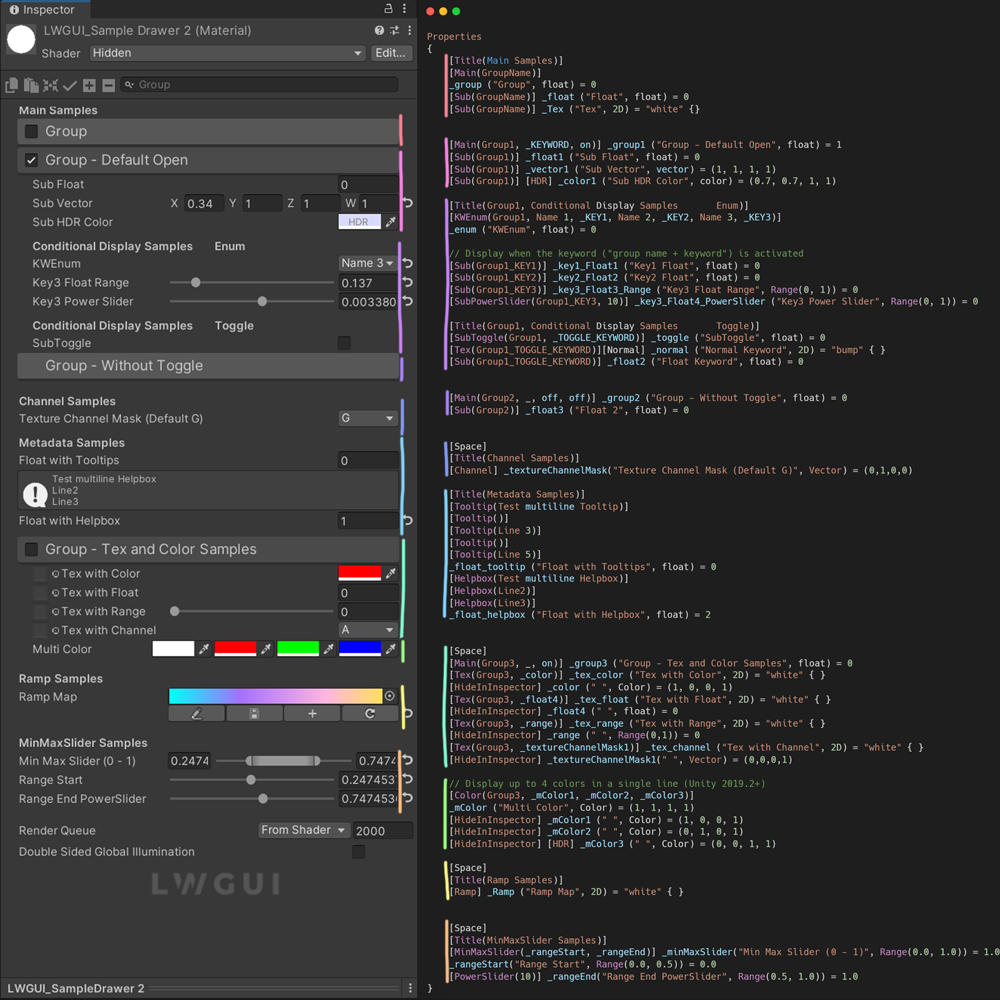
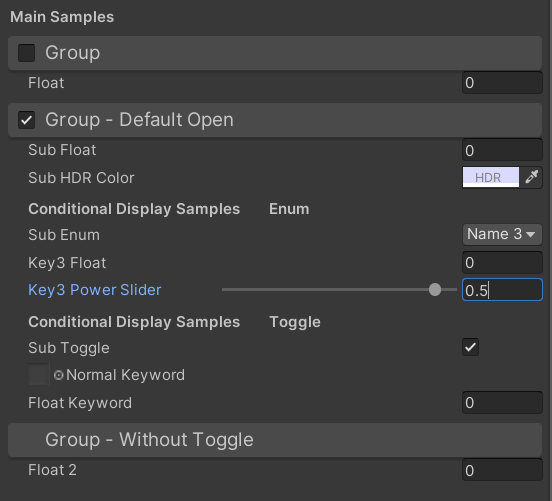
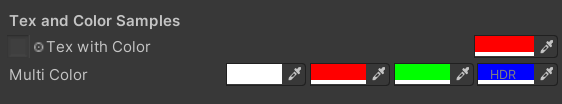
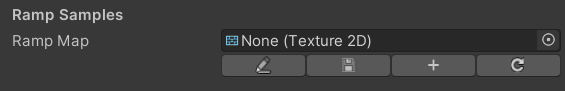
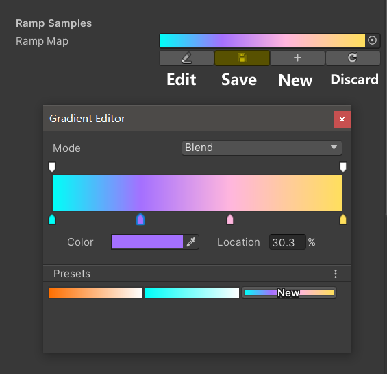
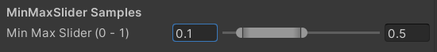
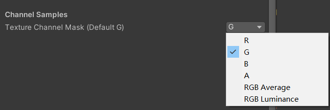

# LWGUI (Light Weight Shader GUI)

[中文](https://github.com/JasonMa0012/LWGUI/blob/main/README_CN.md) | [English](https://github.com/JasonMa0012/LWGUI)

一个轻量, 灵活, 强大的**Unity Shader GUI**系统.

使用简洁的MaterialPropertyDrawer语法实现功能复杂的Shader GUI, 节省大量开发时间, 易于使用和扩展, 有效提升美术的使用体验.




- [LWGUI (Light Weight Shader GUI)](#lwgui--light-weight-shader-gui-)
  * [Installation](#installation)
  * [Usage](#usage)
    + [Getting Started](#getting-started)
    + [LWGUI Drawers](#lwgui-drawers)
      - [Main & Sub](#main---sub)
      - [SubToggle](#subtoggle)
      - [SubPower](#subpower)
      - [KWEnum](#kwenum)
      - [Tex & Color](#tex---color)
      - [Ramp](#ramp)
      - [MinMaxSlider](#minmaxslider)
      - [Channel](#channel)
      - [Title](#title)
    + [Unity Builtin Drawers](#unity-builtin-drawers)
      - [Space](#space)
      - [Header](#header)
      - [Enum](#enum)
      - [IntRange](#intrange)
      - [KeywordEnum](#keywordenum)
      - [PowerSlider](#powerslider)
      - [Toggle](#toggle)
    + [Tips](#tips)
  * [TODO](#todo)
  * [Contribution](#contribution)
    + [Tips](#tips-1)


## Installation

1. 确保你的环境兼容LWGUI: **Unity 2017+**
2. 打开已有工程
3. （可能需要代理）`Window > Package Manager > Add > Add package from git URL` 输入`https://github.com/JasonMa0012/LWGUI.git`
   - 你也可以选择手动从Github下载Zip，然后从`Package Manager > Add package from disk`添加Local Package

## Usage

### Getting Started

1. 新建一个Shader或使用现有的Shader
2. 在代码编辑器中打开Shader
3. 在Shader最底部, 最后一个大括号之前, 添加行:`CustomEditor "LWGUI.LWGUI"`
4. 完成! 开始使用以下功能强大的Drawer轻松绘制你的ShaderGUI吧
   - MaterialPropertyDrawer是一种类似C# Attribute的语法, 在MaterialProperty前加上Drawer可以更改绘制方式, 更多信息可以查看官方文档:`https://docs.unity3d.com/ScriptReference/MaterialPropertyDrawer.html`

### LWGUI Drawers

#### Main & Sub

```c#
/// Create a Folding Group
/// group：group name (Default: Property Name)
/// keyword：keyword used for toggle, "_" = ignore, none or "__" = Property Name +  "_ON", always Upper (Default: none)
/// default Folding State: "on" or "off" (Default: off)
/// default Toggle Displayed: "on" or "off" (Default: on)
/// Target Property Type: FLoat, express Toggle value
MainDrawer(string group, string keyword, string defaultFoldingState, string defaultToggleDisplayed)
```

```c#
/// Draw a property with default style in the folding group
/// group：father group name, support suffix keyword for conditional display (Default: none)
/// Target Property Type: Any
SubDrawer(string group)
```

Example:

```c
[Title(_, Main Samples)]

[Main(GroupName)]
_group ("Group", float) = 0
[Sub(GroupName)] _float ("Float", float) = 0


[Main(Group1, _KEYWORD, on)]
_group1 ("Group - Default Open", float) = 1
[Sub(Group1)] _float1 ("Sub Float", float) = 0
[Sub(Group1)][HDR] _color1 ("Sub HDR Color", color) = (0.7, 0.7, 1, 1)

[Title(Group1, Conditional Display Samples       Enum)]
[KWEnum(Group1, Name 1, _KEY1, Name 2, _KEY2, Name 3, _KEY3)]
_enum ("Sub Enum", float) = 0

// Display when the keyword ("group name + keyword") is activated
[Sub(Group1_KEY1)] _key1_Float1 ("Key1 Float", float) = 0
[Sub(Group1_KEY2)] _key2_Float2 ("Key2 Float", float) = 0
[Sub(Group1_KEY3)] _key3_Float3 ("Key3 Float", float) = 0
[SubPowerSlider(Group1_KEY3, 10)] _key3_Float4_PowerSlider ("Key3 Power Slider", Range(0, 1)) = 0

[Title(Group1, Conditional Display Samples       Toggle)]
[SubToggle(Group1, _TOGGLE_KEYWORD)] _toggle ("Sub Toggle", float) = 0
[Tex(Group1_TOGGLE_KEYWORD)][Normal] _normal ("Normal Keyword", 2D) = "bump" { }
[Sub(Group1_TOGGLE_KEYWORD)] _float2 ("Float Keyword", float) = 0


[Main(Group2, _, off, off)]
_group2 ("Group - Without Toggle", float) = 0
[Sub(Group2)] _float3 ("Float 2", float) = 0

```

Default result:


Then change values:



#### SubToggle

```c#
/// Similar to builtin Toggle()
/// group：father group name, support suffix keyword for conditional display (Default: none)
/// keyword：keyword used for toggle, "_" = ignore, none or "__" = Property Name +  "_ON", always Upper (Default: none)
/// Target Property Type: FLoat
SubToggleDrawer(string group, string keyWord)
```

用法请参考Main & Sub示例

#### SubPower

```c#
/// Similar to builtin PowerSlider()
/// group：father group name, support suffix keyword for conditional display (Default: none)
/// power: power of slider (Default: 1)
/// Target Property Type: Range
SubPowerSliderDrawer(string group, float power)
```

用法请参考Main & Sub示例

#### KWEnum

```c#
/// Similar to builtin Enum()
/// group：father group name, support suffix keyword for conditional display (Default: none)
/// n(s): display name
/// k(s): keyword
/// Target Property Type: FLoat, express current keyword index
KWEnumDrawer(string group, string n1, string k1, string n2, string k2, string n3, string k3, string n4, string k4, string n5, string k5)
```

用法请参考Main & Sub示例

#### Tex & Color

```c#
/// Draw a Texture property in single line with a extra property
/// group：father group name, support suffix keyword for conditional display (Default: none)
/// extraPropName: extra property name (Unity 2019.2+ only) (Default: none)
/// Target Property Type: Texture
/// Extra Property Type: Any
TexDrawer(string group, string extraPropName)
```

```c#
/// Display up to 4 colors in a single line
/// group：father group name, support suffix keyword for conditional display (Default: none)
/// color2-4: extra color property name (Unity 2019.2+ only)
/// Target Property Type: Color
ColorDrawer(string group, string color2, string color3, string color4)
```

Example:

```c#
[Space(50)]
[Title(_, Tex and Color Samples)]

[Tex(_, _color)] _tex ("Tex with Color", 2D) = "white" { }
[HideInInspector] _color (" ", Color) = (1, 0, 0, 1)

// Display up to 4 colors in a single line (Unity 2019.2+)
[Color(_, _mColor1, _mColor2, _mColor3)]
_mColor ("Multi Color", Color) = (1, 1, 1, 1)
[HideInInspector] _mColor1 (" ", Color) = (1, 0, 0, 1)
[HideInInspector] _mColor2 (" ", Color) = (0, 1, 0, 1)
[HideInInspector] [HDR] _mColor3 (" ", Color) = (0, 0, 1, 1)

```

Result:



#### Ramp

```c#
/// Draw a Ramp Map Editor (Defaulf Ramp Map Resolution: 2 * 512)
/// group：father group name, support suffix keyword for conditional display (Default: none)
/// defaultFileName: default Ramp Map file name when create a new one (Default: RampMap)
/// defaultWidth: default Ramp Width (Default: 512)
/// Target Property Type: Texture2D
RampDrawer(string group, string defaultFileName, float defaultWidth)
```

Example:

```c#
[Space(50)]
[Title(_, Ramp Samples)]
[Ramp] _Ramp ("Ramp Map", 2D) = "white" { }

```

Result:



New a Ramp Map and edit:



你**必须手动保存编辑结果**, 如果有未保存的修改, Save按钮将显示黄色.

**在你移动或者复制RampMap的时候, 切记要连同.meta文件一起移动, 否则将无法再次编辑!**

#### MinMaxSlider

```c#
/// Draw a min max slider (Unity 2019.2+ only)
/// group：father group name, support suffix keyword for conditional display (Default: none)
/// minPropName: Output Min Property Name
/// maxPropName: Output Max Property Name
/// Target Property Type: Range, range limits express the MinMaxSlider value range
/// Output Min/Max Property Type: Range, it's value is limited by it's range
MinMaxSliderDrawer(string group, string minPropName, string maxPropName)
```
Example:

```c#
[Title(_, MinMaxSlider Samples)]

[MinMaxSlider(_, _rangeStart, _rangeEnd)] _minMaxSlider("Min Max Slider (0 - 1)", Range(0.0, 1.0)) = 1.0
[HideInInspector] _rangeStart("Range Start", Range(0.0, 0.5)) = 0.0
[HideInInspector] _rangeEnd("Range End", Range(0.5, 1.0)) = 1.0

```

Result:



#### Channel

```c#
/// Draw a R/G/B/A drop menu
/// group：father group name, support suffix keyword for conditional display (Default: none)
/// Target Property Type: Vector, used to dot() with Texture Sample Value
ChannelDrawer(string group)
```
Example:

```c#
[Title(_, Channel Samples)]
[Channel(_)]_textureChannelMask("Texture Channel Mask (Default G)", Vector) = (0,1,0,0)

......

float selectedChannelValue = dot(tex2D(_Tex, uv), _textureChannelMask);
```




#### Title

```c#
/// Similar to Header()
/// group：father group name, support suffix keyword for conditional display (Default: none)
/// header: string to display
TitleDecorator(string group, string header)
```


### Unity Builtin Drawers

#### Space

```c#
MaterialSpaceDecorator(float height)
```

#### Header

```c#
MaterialHeaderDecorator(string header)
```

#### Enum

```c#
MaterialEnumDrawer(string n1, float v1, string n2, float v2, string n3, float v3, string n4, float v4, string n5, float v5, string n6, float v6, string n7, float v7)
```


#### IntRange

```c#
MaterialIntRangeDrawer()
```


#### KeywordEnum

```c#
MaterialKeywordEnumDrawer(string n1, float v1, string n2, float v2, string n3, float v3, string n4, float v4, string n5, float v5, string n6, float v6, string n7, float v7)
```


#### PowerSlider

```c#
MaterialPowerSliderDrawer(float power)
```


#### Toggle

```c#
MaterialToggleUIDrawer(string keyword)
```


### Tips

1. SubToggle和SubPower这种以”Sub”+”内置Drawer”命名的Drawer功能与内置版本相同, 只增加了在折叠组内显示的功能

## TODO

- [ ] 支持ShaderGraph or ASE

- [ ] per material保存折叠组打开状态
- [ ] 支持Unreal风格的Revertable GUI
- [ ] 支持HelpBox
- [ ] 支持改文字格式
- [ ] 支持Tooltip, 显示默认值和自定义内容
- [ ] 支持右上角菜单全部展开或折叠
- [ ] 支持Pass开关
- [ ] 支持Curve
- [ ] 支持搜索框


## Contribution

1. 使用不同Unity版本创建多个空工程
2. 拉取repo
3. 使用符号链接将此repo放到所有工程的Assets或Packages目录内
4. 在`ShaderDrawer.cs`内继承`SubDrawer`开始开发你的自定义Drawer
5. 检查功能在不同Unity版本是否正常
6. Pull requests

### Tips

todo


